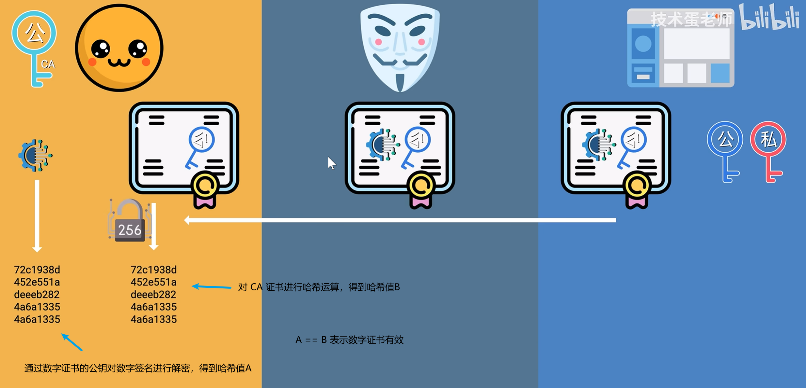
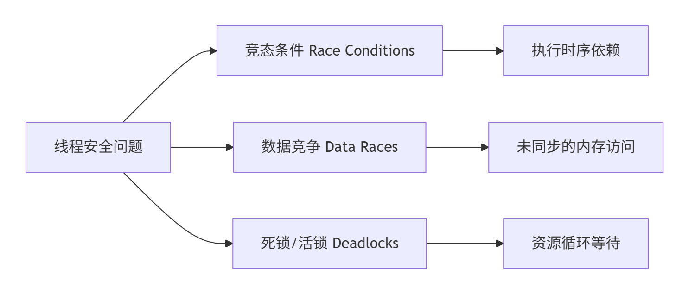

# 字节跳动抖音基础技术部二面复盘

## 自我介绍

自我介绍非常重要。

## 多任务 RHEED 图像分析方法研究

因为面试的岗位是客户端，所以和一面不同的是，这次直接从客户端入手。

**问题1：**项目用到了 MVVM 模式，可以解释一下为什么使用 MVVM 模式吗，顺便聊一下为什么不使用如 MVC 等模式，有对比过差异吗？

算是软件架构模式的一个常考题目了，项目三使用到了，可以结合图像处理的步骤来理解什么是 MVVM 模式。


> <center>
>   
> </center>
>
> 基本概念：Model - View - View Model
>
> - Model：模型层，属于程序的业务逻辑层，主要是负责实现一些业务逻辑；
> - View：界面层，UI显示，主要是与用户进行交互；
> - View Model：界面模型层，是 Model 和 View 进行数据交互的桥梁，可以接收 View 的一些请求，然后根据请求调用 Model，Model 根据请求进行业务处理，然后将业务处理的结果返回给 View。
>
> 结合项目三的 RHEED 斑点检测流程：
>
> 用户点击目标检测按钮（View） ==> 槽函数（View Model） ==> 创建子线程 ==> 子线程通过目标检测算法类对象，执行目标检测算法（Model） ==> 子线程注册信号 ==> 通过信号将目标检测的结果发送给主线程（View Model） ==> 主线程通过槽函数处理信号（View Model） ==> 将目标检测的结果显示到 UI 上（View）。


**问题2：**关于设计模式，了解过哪些（好像除了工厂者模式，其它都不会）？

> 工厂者模式：基于多态实现，多种目标检测算法的集成。
>
> |  模式名称  |      解决的核心问题      |     关键设计原则     |
> | :--------: | :----------------------: | :------------------: |
> |  单例模式  |   全局唯一资源访问冲突   |      控制实例化      |
> |  工厂模式  |     对象创建依赖耦合     |  封装变化，面向接口  |
> | 观察者模式 |  状态变更的实时响应需求  |   松耦合，事件驱动   |
> |  策略模式  |       算法灵活切换       |   多态替代条件判断   |
> | 装饰器模式 | 动态扩展功能，避免类爆炸 |     组合优于继承     |
> | 适配器模式 |        接口不兼容        | 转换接口，复用旧代码 |
> | 责任链模式 |   请求处理链路动态组织   |     解耦处理对象     |


**问题3：**从项目2入手，简单说一下这个项目的主要逻辑是什么吧？（项目2 需要去详细的复盘一下）

> 可以从数据流出发：
>
> 数据抽取模块（转 XML） ==> 文件传输模块（备份 XML 文件） ==>   数据入库模块（XML 文件入库） ==> 数据同步模块（将数据存储到其它数据库服务器上） ==> 数据访问接口模块（解析 HTTP 请求，发 HTTP 响应）
>


**问题4：**基于问题 4，说到了数据抽取部分，为什么使用 XML 文件格式，将从其它数据库服务器或开放性网站抽取的数据进行存储？

> 当时只能简单的回答一下，说 XML 文件的数据组织形式比较结构化一点，解析起来比较方便。
>
> 可以尝试结合项目的**数据入库模块**稍微深入一点，XML 文件内容组织形式是基于标签的树型结构，在设计数据库表的时候，有将字段名和 XML 文件的标签名进行对应，程序在执行入库的时候，只需要解析标签名和标签内容，就能高效实现入库了。
>
> **优点：**
>
> - XML 文件是树型的数据结构，加上气象数据比较复杂（比如时间、地点、温度等），树型数据结构可以实现多参数的嵌套；
> - XML 文件内的标签和标签里的内容和 oracle 数据库中的字段名和字段值高度匹配，在 XML 文件入库的时候，解析起来非常方便。
> - 拓展点：<font color = red>XSD（XML Schema Definition）机制可以定义和约束 XML 文档结构的规范，可以在文件中对数据进行校验，比如指定字段类型，避免非法值等。</font>
>
> 拓展点是 XML 文件存储数据的最大优势，对于以后项目的拓展，比如存储更加复杂的数据类型，让 XSD 实现部分的数据校验，简化程序的数据校验工作，而且 XML 树型的数据结构，让复杂数据类型的存储也能很有结构性。
>
> **缺点：**
>
> - 存在大量的重复标签，所以 XML 文件对比 json 等存储相同的数据信息，文件体积会大很多；
> - 虽然解析方便，但是解析速度比较慢。


**问题5：**你说到了使用内存映射的方式，从磁盘读取 XML 文件到内存中，说一下内存映射和传统的文件 IO 有什么优势（尤其是大文件）？

> 这里属于乌龙事件了，项目里面没有用到内存映射的方式🤣，而是直接将 XML 文件读取到内存中进行了解析（对项目二不太熟悉），不过对比内存映射和传统文件 IO 非常值得深入思考。传统文件 IO 和 `mmap` 的区别：
>
> |       **机制**       |         传统 `read()`/`write()`          |                          `mmap()`                          |
> | :------------------: | :--------------------------------------: | :--------------------------------------------------------: |
> | **用户空间访问位置** |         独立的用户缓冲区 (`buf`)         |                 直接访问映射区域 (`addr`)                  |
> |   **内核数据位置**   |            页缓存（内核空间）            |               页缓存（与用户空间共享物理页）               |
> |     **拷贝次数**     |           2次 (DMA + CPU复制)            |                      0次（仅DMA加载）                      |
> |     **CPU参与**      |           需要CPU执行内存复制            |                仅缺页异常处理（无数据复制）                |
> |   **虚拟地址转换**   |        用户虚拟页→用户物理页关联         |               用户虚拟页→内核物理页直接关联                |
> |    **多进程访问**    | 不支持，同一个文件需要拷贝多次到用户空间 | 支持（只要多进程能获得操作内存映射的指针），共享内核物理页 |
> |      **安全性**      |    用户空间，手动申请和释放（堆栈区）    |          内核空间，当物理内存不足，内核会进行释放          |
>
> 传统文件 IO 数据流程：磁盘 ==> DMA 控制器 ==> 内核空间（物理内存中） ==> 进程用户空间（物理内存中），涉及 2 次内存拷贝，而且从内核空间到用户空间需要 CPU 参与。
>
> 内存映射数据流程：磁盘 ==> DMA 控制器（`mmap()`只加载，不拷贝数据） ==> 通过指针操作内存映射区 ==> 缺页中断 ==> DMA 控制器将数据从磁盘拷贝到内核空间 ==> 进程通过页表从虚拟地址到物理地址的映射，直接访问内核空间，不涉及从内核空间到用户空间的拷贝。
>
> 调用 `mmap()` 系统调用不会产生磁盘到物理内存的拷贝，`mmap()` 给用户空间返回了一个可以操作内存映射的 `void*` 指针，只有用户空间通过这个指针操作内存映射时，内存映射的内容不在物理内存中，产生缺页中断，才会将文件从磁盘加载到内核空间中。
>
> **拓展**：关于大文件的是如何加载到内存中的，主要涉及到的是 OS  的内存管理部分，我们常常通过使用系统调用`open()`、`read()`、`mmap()`来实现磁盘与内存的数据交互，OS 通过页式和段式管理内存，使得我们可以运行大于进程虚拟地址空间的程序、操作大于进程虚拟地址空间的文件，所以，可以肯定的是，理论上，一个程序可以处理无限大的文件。
>
> 针对**问题5**的面试回答，可以从传统 IO 和 内存映射的工作原理来剖析，其实本质就是传统 IO 存在内核缓冲区和用户缓冲区的数据拷贝，限制了程序处理数据的性能。
>
> ```c++
> // open() 系统调用只会返回操作文件的文件句柄（fd）
> int fd = open(...);
> 
> // read() 系统调用存在内存拷贝，对于大文件的读取，会产生缺页中断
> int ret = read(fd, ...);
> 
> // mmap() 系统调用不存在内存拷贝，向用户空间返回一个操作内核空间的指针
> void* ptr = mmap(fd, ...);
> ```
>


**问题6：**说一说内存映射的具体流程是怎么样的，对于 XML 大文件的内存映射，又是一个什么样的机制？

属于基础性的问题，面试官主要是想考察对<font color = red>项目中用到的技术栈</font>的熟悉程度。

```c++
/*
		内存映射具体步骤如下
		1. 打开目标文件，获取文件描述符
		2. 获取文件的大小
		3. 创建内存映射，posix 库对于内存映射，会以OS设置的页大小整数倍进行映射
		4. 通过第三步返回的指向内存映射的指针，操作内存映射（可读可写）
		- 读：不需要同步数据到磁盘
		- 写：
		5. 解除内存映射
*/


int fd = open("large_file.dat", O_RDWR);

struct stat sb;		// 文件大小存储在 sb.st_size
fstat(fd, &sb);  

void *addr = mmap(
    NULL,                // 内核自动选择映射地址
    sb.st_size,           // 映射长度 = 文件大小
    PROT_READ | PROT_WRITE, // 内存权限：可读可写
    MAP_SHARED,           // 修改同步到文件（区别于 MAP_PRIVATE）
    fd,                   // 文件描述符
    0                     // 文件偏移量（从0开始映射）
);

int *data = (int*)addr;
// 直接修改内存 = 修改文件内容
data[0] = 0x12345678;  

// 解除内存映射
munmap(addr, sb.st_size);  
close(fd);  

```

针对大文件的内存映射，这里面试官应该是想通过大文件内存映射，进一步深入到 OS 的内存管理内容，可惜没答上来。

由创建内存映射的流程可知，我们在使用 `mmap()` 系统调用的时候，可以指定**映射的大小**，这个大小必须是**页大小的整数倍**，所以，针对大文件的内存映射，不能直接映射整个文件，可以对大文件进行分块映射，块大小可以自定义，但必须是页大小整数倍。

``` c++
#define CHUNK_SIZE (1UL << 30)  // 1GB 块，自定义块的大小必须是页大小的整数倍

// 使用 for 循环对大文件进行分块映射，分块映射的缺点是，会产生缺页中断
for (off_t offset = 0; offset < sb.st_size; offset += CHUNK_SIZE) {
    size_t length = (offset + CHUNK_SIZE > sb.st_size) 
                  ? sb.st_size - offset : CHUNK_SIZE;
    
    void *chunk = mmap(NULL, length, PROT_READ, MAP_SHARED, fd, offset);
    // 操作当前分块...
    munmap(chunk, length);
}
```

大文件的内存映射对比传统的文件 IO 有**非常大的性能优势**，参考问题 5 的深入对比。

**问题7：**绕过了客户端和项目相关的问题，这次直接从 c++ 来做切入点，你了解 c++ 吗，顺便解释一下什么是多态吧？

面向对象编程中的多态，分为静态多态和动态多态。

静态多态比如函数重载、模板特化，这些都是在程序编译的过程中，就确定了其具体调用哪一个函数、类型等。

动态多态：指的是在程序运行的过程中，父类指针或引用调用子类对象重写的虚函数，因为虚函数被子类重写了嘛，重写的虚函数会在子类的虚函数表中进行替换，把虚函数表中父类的虚函数地址替换成自己重写的虚函数地址（需要注意，每一个包含或继承了有虚函数父类的类，都有自己的虚函数表和虚函数指针）。


**问题8：**基于问题 7 的深入，既然说到了虚函数表，那么，在构造函数中可以执行虚函数吗？

显然是不行的（这是高频题），因为在执行构造函数的过程中，需要为有虚函数的对象分配虚函数指针和虚函数表，虚函数执行的入口地址查找需要虚函数指针和虚函数表，所以是不行的。


**问题9：**你知道 new 和 malloc 的区别吗？（这个问题不应该答不出，看过，但是没形成深刻的印象）

好像确实不太会🤣🤣🤣，之前的浅印象貌似也是错的，主要区别如下：

> 1.**构造与析构（核心区别）**
>
> new/delete 会自动调用自定义数据类型的构造函数和析构函数，而 malloc()/free() 不会，需要手动调用。
>
> 2.**类型安全**
>
> new 直接返回对应数据类型的指针，而 malloc() 返回的是 (void *)，需要进行强制类型转换。
>
> 3.**错误处理**
>
> new 默认执行失败会抛出异常，而 malloc() 执行失败直接返回 NULL。
>
> 4.**数组处理**
>
> 本质和 1 是一样的，new 自动调用所有元素的构造函数，而 malloc() 需要手动调用。
>
> 5.**自定义行为**
>
> new 可以实现重载，而 malloc() 不可以。

**拓展：**delete 和 free() 的区别？

> 1.**构造与析构（核心）**
>
> delete 会自动执行析构函数，而 free() 需要手动执行析构函数。
>
> 2.**关于内存释放**
>
> 由于 delete 会自动执行析构函数，在析构函数中，如果我们有对申请的堆区内存进行释放，那么不会出现内存泄露的问题，而 free() 由于不会自动执行析构函数，如果忘记手动执行析构，free() 只会释放对象占用的基本堆区空间，对于构造函数申请的堆区空间不会释放，从而导致内存泄漏。


**问题10：**HTTP 和 HTTPS 的区别，客户端如何验证服务器端的 CA 证书是否有效？（这个问题真的是高频题目了）

这个问题可以回答的非常细致，先说一下 HTTPS 协议的大致流程吧。

> **TLS 1.2 协议**的 HTTPS 安全通信流程如下（RSA 密钥交换）：
>
> 经过了 TCP 的三次握手之后，进行 TLS 握手，流程如下：
>
> <center>
>   
> </center>
>
> **出现问题：**如果服务器的<font color =red>私钥</font>泄漏了，那么客户端给服务器发送公钥加密的数据就会被攻击者解析。
>
> **TLS 1.3 协议**在上述协议的基础上，进一步提升了 HTTPS 的安全性（ECDHE 密钥交换）：


**拓展：**关于如何验证 CA 证书有效的问题，保证 CA 证书对应上服务器，而不是攻击者，或者攻击者修改 CA 证书的内容，客户端又该怎么辨别 CA 证书的有效性？

> **第三方证书颁发机构（Certificate Authority，CA）**
>
> CA 证书的工作原理大致如下：
>
> <center>
>   
> </center>
>
> - 服务器通过给 CA 颁发机构公钥和域名等相关信息，申请 CA 证书；
> - CA 证书颁发机构对服务器的相关信息进行哈希运算（数据压缩），生成哈希字符；
> - CA证书颁发机构通过**CA私钥进行加密（解密用 CA 公钥）**，生成**数字签名**，并且在 CA 证书上**提供解密数字签名的公钥（区分服务器通信的公钥）**；
> - 客户端通过CA证书里面的公钥对**数字签名**进行解密，得到哈希值A；
> - 对 CA 证书进行哈希运算，得到哈希值B；
> - A==B 说明 CA 证书有效，反之，CA 证书内容被纂改过；
>
> **数字签名不可能被纂改，亦或者是数字签名被纂改，通过 CA 证书公钥解密数字签名得到的哈希值与 CA 证书内容对应的哈希值不可能一样**
>
> <center>
>   
> </center>
>
> **CA证书链和根CA**
>
> 为什么要有 CA 证书链（中间 CA）：可以有效避免根 CA 与服务器直接接触，提高了整个 CA 系统运行的稳定性，如果存在中间 CA 宕机了，由于有其他中间 CA，不至于 HTTPS 协议无法使用。
>
> <center>
>   
> </center>
>
> 结合根 CA 证书，客户端验证 CA 证书的验证流程如下：
>
> <center>
>   
> </center>
>
> 
>
> - 浏览器在服务器 CA 证书内容，获取中间 CA 的公钥，解密服务器 CA 证书数字签名，获取哈希值A1，并且对服务器 CA 证书执行哈希算法，得到哈希值 A2，`A1==A2` 服务器 CA 证书验证通过；
> - 浏览器通过中间 AC 证书内容，获取根 CA 的公钥，解密中间 CA 证书的数字签名，获取哈希值B1，并且对中间 CA 证书执行哈希算法，得到哈希值 B2，`B1==B2` 中间 CA 证书验证通过；
> - 浏览器通过**OS或浏览器缓存**获取解密根 CA 证书的公钥，解密根 CA 证书的数字签名，获取哈希值C1，并且对根 CA 证书执行哈希算法，得到哈希值 C2，`C1==C2` 根 CA 证书验证通过；
> - 验证 ”服务器 ==> 中间 CA ==> 根CA“ 的 CA 证书信任链是否完整；
> - 附加校验（也属于是 CA 证书内容的部分）：证书有效期、是否吊销、域名是否匹配等。


**问题11：**了解什么是函数代理吗？

先简单说一下吧，结合项目中的使用场景。

> 函数指针：通过函数指针去间接调用函数接口；
>
> 回调函数：项目一中，收到 SIGALRM 信号，触发定时器回调函数，检查每一个 TCP 连接活跃是否到期；
>
> 事件处理机制：项目三中，比如我点击加载视频按钮，我的 Panel 组件中加载了视频，槽函数实现的业务逻辑是一种事件处理机制，也认为是函数代理的一种；


**问题12：**知道 c++ 的智能指针吗，对于智能指针  `shared_ptr<T>` 是线程安全的吗，如果不是，为什么？

c++ 中智能指针有 4 种，分别是 `auto_ptr<T>` 和 `unique_ptr<T>` 和 `shared_ptr<T>` 和 `weak_ptr<T>`，其中后三种是 c++11 新特性。

关于线程安全问题：

> 线程安全的本质：在Linux C++多线程编程中，线程安全（Thread Safety）指的是当多个线程**并发访问共享资源**时，程序仍能保持**正确的行为和数据一致性**。
>
> <center>
>   
> </center>
>
> - `shared_ptr` 的引用计数是原子操作，是线程安全的；
>
> - `shared_ptr` 指向的共享资源是非线程安全的，需要开发人员使用同步原语或者其它线程安全的方法，保证线程安全。

## **手撕题目**

三个线程依次打印 1~100 的数字（如此简单的题目，但却由于 API 的调用问题，卡住并且不会了）。

```c++
#include<iostream>
#include<thread>
#include<mutex>
#include<condition_variable>
#include<vector>

using namespace std;

mutex mtx;
condition_variable cv;
int num = 1;
const int MAX_NUM = 100;
int cur_thread_id = 0;     // 轮换线程

void function(int thread_id) {
    while (1) {
        // 互斥锁，unique_lock 属于 RAII 资源，当前作用域执行完自动释放
        unique_lock<mutex> lock(mtx);
        // 条件变量，获得互斥锁的线程，会执行条件变量检查函数，当条件变量检查函数返回true时，阻塞解除，否则继续阻塞并且释放互斥锁
        cv.wait(lock, [thread_id]()->bool {
            return (num > MAX_NUM) || (cur_thread_id == thread_id);
            });

        if (num > MAX_NUM) {
            cv.notify_all();    // 通知所有线程退出，执行wait()函数
            break;
        }

        cout << "Thread id " << thread_id << ": " << num++ << endl;
        cur_thread_id = (cur_thread_id + 1) % 3;
        cv.notify_all();
    }
}

int main() {
    const int nums = 3;
    vector<thread> threads;

    for (int i = 0;i < nums;++i) {
        threads.emplace_back(function, i);
    }
		
  	
    for (auto& thread : threads) {
        thread.join();      // 等待所有子线程结束
    }
  
    system("pause");
    return 0;
}
```

线程池

```c++
#include<thread>
#include<iostream>
#include<list>
#include<vector>
#include<condition_variable>
#include<mutex>
using namespace std;

/*
    线程池实现，伪代码 ==> 完全版本

    几个重要成员变量：
        - 工作队列：存放任务类对象
        - 互斥锁和条件变量：多线程同步访问工作队列
        - 线程数量和线程池数组
        - 线程停止运行标志变量

    几个重要成员方法：
        - void append(T* task): 向工作队列中加入任务类对象
        - void run(): 从工作队列中取出任务，并且让线程运行
        - ThreadPool(): 初始化线程池，并且创建线程
        - ~ThreadPool(): 回收线程池资源


*/

template<typename T>
class ThreadPool {
private:
    // 线程池数组
    vector<unique_ptr<thread>> m_threads;
    // 线程数量
    int m_thread_num;
    // 互斥锁
    mutex m_mtx;
    // 条件变量模拟信号量
    condition_variable cv;
    // 工作队列
    list<T*> m_queueworker;
    // 是否结束线程
    bool m_stop;
public:
    ThreadPool(int thread_num = 4);
    ~ThreadPool();
    bool append(T* task);
private:
    // 线程运行函数
    void run();
};

template<typename T>
ThreadPool<T>::ThreadPool(int thread_num) :m_thread_num(thread_num), m_stop(false) {
    if (thread_num <= 0) {
        exit(-1);
    }
    // 创建 thread_num 个线程
    for (int i = 0;i < thread_num;++i) {
        m_threads.emplace_back(new thread([this]() {run();}));
    }
}

template<typename T>
bool ThreadPool<T>::append(T* task) {
    {
        unique_lock<mutex> lock(m_mtx);
        m_queueworker.push_back(task);
    }
    // 唤醒被条件变量阻塞的线程
    cv.notify_all();
    return true;
}

template<typename T>
void ThreadPool<T>::run() {
    while (!m_stop) {
        unique_lock<mutex> lock(m_mtx);
        cv.wait(lock, [this]() {
            return !m_queueworker.empty() || m_stop;
            });

        if (m_queueworker.empty() || m_stop) {
            continue;
        }

        T* task = m_queueworker.front();
        m_queueworker.pop_front();


        // 任务类对象执行 process 方法
        if (!task) {
            continue;
        }

        task->process();
    }
}


template<typename T>
ThreadPool<T>::~ThreadPool() {
    {
        // 修改互斥资源，记得上锁
        unique_lock<mutex> lock(m_mtx);
        m_stop = true;
    }

    // 通知所有被条件变量阻塞的线程
    cv.notify_all();

    // 回收子线程资源
    for (auto& thread : m_threads) {
        if (thread->joinable()) {
            thread->join();
        }
    }

}
```

## 反问环节

问了一下关于学习的问题，也就是对于基础的知识和项目经验，面试官更看重哪一点？

忘记具体怎么回答的了，反正大概意思就是，这两者的学习不冲突，通过做项目遇到的难点，来对一个关键基础知识技术点进行详细拆解，关键是要学会理解其原理。

从整个复盘问题的角度来看，真的有感觉到面试官水平好高啊，羡慕++。

## 一些碎碎念

为什么会有进程的虚拟地址空间，进程的虚拟地址和进程的虚拟地址空间和我们常说的虚拟内存有什么联系？

什么是 DMA 控制器，DMA 机制下，是不是只有内核空间到用户空间的数据交互才有 CPU 的参与？

