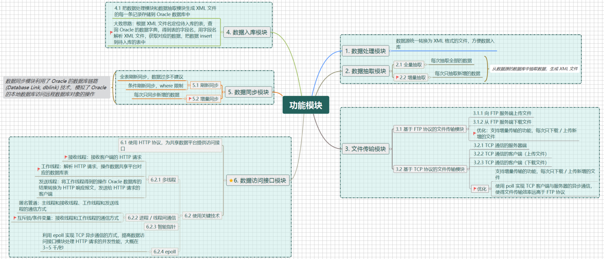

[TOC]

# 第七章 开发框架

7.1 开发框架介绍

7.2 字符串操作

一些命令补充

# 第八章 生成测试数据集


# 第九章 服务程序的监控和调度

## 9.1 业务需求

## 9.2 调度模块

## 9.3 进程的心跳机制

## 9.4 守护模块

## 9.5 运行策略

服务程序的运行策略

> - 全部的服务程序启用心跳机制，调度模块和守护模块除外；
> - 全部的服务程序由调度模块启动；
> - 启动守护模块 `checkproc` ，如果服务程序在心跳机制的检测下超时，就终止该服务程序。

面临问题：<font color = red>调度程序和服务程序死掉了怎么办 ?</font>

> - 越复杂的程序越容易出现异常被杀死，特别是用到网络通讯的程序；
> - 简单的程序不会被杀死；
> - 在实际开发中，把系统**分解成简单的模块**是明智的选择。

## 9.6 两个小工具

> 清理文件：删除指定目录中的历史数据文件
>
> 压缩文件：压缩指定目录中的历史数据文件

# 第十章 基于 ftp 的文件传输模块

## 10.1 ftp 应用场景

> - ftp 协议简单通用，创建 ftp 服务很容易
> - 适用于在局域网内部网络环境中进行文件传输
>
> <font color= red>项目功能需求</font>
>
> - 文件下载模块：从 ftp 服务端下载文件
> - 文件上传模块：把本地的文件上传到 ftp 服务端
>
> 在 Github 中，开源了很多已经实现好的 ftp 服务程序框架，直接搜索 `ftplib` 即可找到。

## 10.2 实现 ftp 文件下载模块

> <font color = red>第一部分：</font>
>
> - 这是一个通用的功能模块，应用场景不限于某个项目
> - 程序的逻辑和代码比较复杂，可提升代码能力
> - 从简单的开始，逐步完善其功能
>
> <font color = red>第二部分：</font>
>
> - 下载文件后，删除 ftp 服务器上的文件
> - 下载文件后，把 ftp 服务器上的文件移动到备份目录
>
> <font color = red>第三部分：</font>
>
> - 增量下载文件，每次只下载新增和修改过的文件
>   - 通过文件的修改时间来判断文件是否被修改过

## 10.3 实现 ftp 文件上传模块

> - 上传文件后，删除 ftp 客户端的文件
> - 上传文件后，把 ftp 客户端的文件移动到备份目录
> - 增量上传文件，每次只上传新增的和修改过的文件
>
> 实现思路和文件下载模块一样。

# 第十一章 基于 TCP 协议的文件传输模块

关于 TCP 协议通信的**特点**如下：

> - 自定义通讯方式，数据从一端传输到另一端之后，可以自定义处理方法；
> - 效率高，适用于系统内部快速高效的传输文件；
> - TCP 连接请求是由客户端主动发起的；
> - TCP 连接建立之后，不再区分客户端和服务端；
> - TCP 通信是全双工的，任何一方都可以发送和接收报文；
> - 请求 / 回应报文是业务层面的，本质都是 TCP 报文；
> - 请求报文可以由客户端发起，也可以由服务端发起，由业务决定；
> - TCP 通信的方式没有固定模式，双方约定好就行了，即协议。

## 11.1 TCP 短连接与长连接

**TCP 短连接：**客户端向服务器端发送 TCP 连接请求，服务器端响应 TCP 连接，一次 TCP 连接只传输一次数据包。

<center>
  

**TCP 长连接：**与 TCP 短连接不同的是，长连接在客户端与服务器端建立连接之后，可以传输多次数据包（长时间不断开连接）。

<center>
  
</center>

> TCP 长连接的心跳机制
>
> - 定期向连接的对端发送约定格式的报文，并且等待对端的回应；
> - 如果约定的时间内返回了报文，那么连接正常，否则已经断开连接。

## 11.2 TCP 通信的同步与异步

> 同步方式：发送方在发出报文之后，必须等对方的回复以后才发送下一个报文。
>
> <center>
>   
> </center>
>
> 异步方式：发送方发出报文之后，不必等待对方的回复，继续发送其它的报文。
>
> <center>
>   
> </center>
>
> **TCP 异步通信方式的优缺点**：效率高但编程复杂。

**TCP 异步通信的实现方法**

> - 多进程：建立 TCP 连接之后，一个进程发送报文，一个进程接收报文；
> - 多线程：建立 TCP 连接之后，一个线程发送报文，一个线程接收报文；
> - I/O 多路复用技术：`select`, `poll`, `epoll` 等方法。

## 11.3 TCP上传文件与下载文件

**上传：**客户端扫描本地目录，把文件发送给服务端；**下载：**服务端扫描本地目录，把文件发送给客户端；上传文件与下载文件的代码逻辑本质上是一样的。

# 第十二章 Oracle 数据库基础 1


# 第十三章 Oracle 数据库基础 2

# 第十四章 Cpp 开发 Oracle 数据库

## 14.1 开发前的准备

<font color = red>第一节课就遇到了一个小坑</font>

> 关于 linux 的环境变量问题，涉及到用户根目录下的三个文件：`.bashrc`，`.bash_profile`，`.profile`。
>
> `.bashrc `文件。
>
> - `.bashrc`：这个文件是在**每次打开一个新的终端窗口或启动一个非登录的交互式 shell 时被读取**，它主要用于设置那些希望在每个新终端窗口中都可用的环境变量、别名和函数等；
>
> - `.bash_profile`：仅在**登录时读取**，而 `.bashrc` 在每次启动新的交互式 shell 时都会读取，因此 `.bash_profile` 中有类似 `source ~/.bashrc` 这样的命令，这样可以在登录时同时应用 `.bashrc` 中的设置；
> - `.profile`：是一个更通用的名称，不仅限于Bash shell，其他 shell 也可能使用这个文件来设置环境变量。

## 14.2 在 Linux Cpp 中创建表

## 14.3 在 Linux Cpp 中操作表

## 14.4 存取大型对象

> **大型对象 LOB 类型（Large Object）**
>
> - CLOB 字符型

## 14.5 其他细节

**静态 SQL 语句的安全性问题（SQL注入）**

> 老生常谈的问题，静态 SQL 语句在程序中，能够进行字符串的拼接，所以会产生 SQL 注入的问题。 

**oracle 中 char 和 varchar2 的问题**

> oracle 创建表时，用 char 声明的字段会固定其字符的长度，当该字段的值长度不够时，oracle 会用 ' ' （空格）替代，这就导致了，在 cpp 程序中执行的 SQL 语句和 SQLPlus 中执行的 SQL 语句有出入。
>
> 对于如下表结构：
>
> ```sql
> create table tt(
>        c1 char(5),
>        c2 varchar2(5)
> );
> -- 插入一条数据
> insert into tt values('abc','abc');
> ```
>
> 在 SQLPlus 中执行如下两条语句
>
> ```sql
> select * from tt where C1 = 'abc';
> select * from tt where C1 = 'abc  ';
> -- 都能得到结果
> ```
>
> 在 Linux cpp 程序中执行如下两条语句
>
> ```sql
> select * from tt where C1 = 'abc';
> -- 不能找到结果
> select * from tt where C1 = 'abc  ';
> -- 可以找到结果
> ```

**如何处理数字字段的空值**

> 在 cpp 程序中，`int, double ,char` 等基本数据类型没有空值，而 oracle 中，`number` 有空值，这就导致了，如果使用 cpp 基本数据类型，无法插入空值，或者获取空值。
>
> - 解决方法：如果 oracle 数据库表中 number 字段有空值的情况，用 cpp 的 string 数据类型，进行插入或者获取，`string s = ""` 表示的就是空值。
>
> ```cpp
> // create table tt(c1 number(5),c2 number(5,2));
> 
> string c1 = "";
> string c2 = "";
> stmt.prepare("insert into tt1(c1,c2) values(:1,:2)");
> stmt.bindin(1, c1, 6);
> stmt.bindin(2, c2, 6);
> // 上述 sql 等价于 insert into tt1(c1,c2) values(null, null)
> ```

**oracle 的错误代码**

> 在 oracle 中，oracle 的错误代码有几千个，在 SQLPlus 中执行 SQL 语句出错时，会给出对应的错误代码和错误描述。同理，在 oracle 提供的 OCI 库中，也有对应获取错误代码和错误描述的 API。
>
> - oracle 还提供了命令 `oerr ora <error_code>` 命令来查看对应错误代码的具体错误描述，如 `oerr ora 1`等。

**执行 PL/SQL 过程语句**

> 基本语法如下：
>
> ```cpp
> // 准备 sql 语句
> stmt.prepare("\
> 	begin\
> 		delete from girls where id=:1;\
> 		insert into girls(id,name) values(:2,:3);\
> 		update girls set weight=:4 where id=:5;\
> 	end;");
> ```
>
> - 优点：减少了 cpp 程序与 oracle 数据库服务器通信的次数，如果以上三条语句分开执行，需要和 oracle 数据库通信 6 次，而使用过程语句只需要通信 2次。

## 14.6 全国气象站点参数文件入库

基本步骤如下：

> - 创建表空间，创建数据共享平台的数据库用户，授予权限；
> - 用 Power Designer 设计全国气象站点参数表；
> - 实现全国气象站点参数文件入库的功能模块。 

# 第十五章 数据抽取模块（子系统）

## 15.1 业务需求

<center>
  
</center>

数据抽取模块整体概述

> - 从数据库的表中查询数据，把结果集保存到 xml 文件中；
> - 抽取方法
>   - 全量抽取：按查询条件抽取表中全部的数据（表中的数据会增删改）
>   - 增量抽取：按查询条件抽取表中新增的数据（表中的数据只会新增，不会修改）

```sql
-- 全量抽取：这次拿到的数据可能会和上次拿到的数据重复，例如查询气象站点表（表中的数据集可能会有增删改，一般使用静态 sql 语句）
select * from t_zhobtcode;
select * from t_zhobtcode where obtid like '54%';
select * from t_zhobtcode where uptime > sysdate-1;

-- 增量抽取：每次拿到的数据都是新插入的记录，不会重复，例如查询气象站点观测数据表（使用动态的 sql 语句）

```

## 15.2 搭建程序的框架

试想一下，让我们完成一个查询数据库表，然后将查询的内容写入到文件中的功能，这是一个较为 normal 的功能，但是，**面临的问题是，每一个数据库表的字段都不同**，抽取一个数据库表就要对应一个程序，几千张不同的表就对应几千个程序，显然是不合理的。

这里的数据抽取模块具有以下特点：

> - 它是一个通用的功能模块，实现了抽取数据的 SQL 语句等的参数化；
> - 代码有点繁琐，需要考虑的细节比较多；
> - 课程内容接近真实项目。

## 15.3 全量抽取数据

## 15.4 增量抽取数据

### 15.4.1 一些疑问

为什么存储递增字段最大值的表与需要抽取的数据库表，不使用同一个数据库连接

因为正常的业务需求来说，抽取数据库中表的数据，数据库连接只需要查询权限就 OK 了。而存储递增字段最大值的表，涉及到增删改查操作，**需要更多的数据库操作权限（这个数据库表可以放在本地的数据库服务器中，本质就是为了数据的安全性）**。

# 第十六章 数据入库模块

## 16.1 程序的业务需求

**本模块的大致功能如下：**

> - 把上一章从各政府部门抽取出来的 xml 文件入库到共享平台的数据库种；
> - 数据集有几千种，但是不需要为每种数据写一个入库程序，只需要通过解析程序的运行参数，再执行 insert 操作即可；
> - 目标：开发一个通用的入库程序，用一个模块搞定几千种数据。

**设计思路：**

> - 查找入库参数，根据待入库的文件名，得到对应的表名；
>
> - 根据表名，读取数据字典，得到表的字段名和主键；
>
> - 根据表的字段名和主键，拼接插入和更新的 `sql` 语句；
>
> - 根据表的字段名，从 xml 文件中解析出每个字段数据；
> - 执行插入或更新的 `sql` 语句。

## 16.2 数据库入库模块的一些应用经验

> - 数据入库模块不止适用于数据共享平台，且适用于各种有数据入库需求的项目；
> - 在实际的开发中，数据的文件有很多种，分为俩类：
>   - xml 文件，比如本项目；
>   - 非 xml 文件（解决目前想到的解决方案） ==> 为不同数据格式的文件编写不同的程序，转换为 xml 文件格式；
> - 转换成统一的数据格式（比如 xml 文件）后，数据入库模块的开发就能实现通用性了。
>
> 一些问题：
>
> 入库的文件太多，有些文件比较大，可能长时间处于入库状态，导致其它的文件入库不及时，怎么办？
>
> - 配置多个入库参数文件，启动多个入库模块程序（一个文件对应一个程序，相当于开辟多个入库通道）；
> - 同一种数据使用同一个入库通道，避免多个进程操作同一张表（锁机制会导致数据库性能大幅下降）。

# 第十七章 数据管理模块

## 17.1 业务需求

> - 在实际工作中，最重要的是当前的数据，n 天前的历史数据价值下降；
> - 如果表的记录超过一亿，插入和查询的性能将会略有下降，迁移和备份也不方便；
> - 如果历史数据不需要保存，可以删除它，如果历史数据仍有价值，可以把若干天之前的数据备份到历史表中：
>
> ```sql
> /*
> 	具体做法如下：
> 	- 如果数据量不是特别大，可以只用一个历史表
> 		- T_ZHOBTMIND ==> T_ZHOBTMIND_HIS
> 	- 如果数据量特别大，可以一年一个历史表，或一个月一个历史表
> 		- T_ZHOBTMIND ==> T_ZHOBTMIND_2025
> 		- T_ZHOBTMIND ==> T_ZHOBTMIND_202501
> */
> ```
>
> **删除数据库表中记录面临问题：**
>
> - 数据量很大，会产生大事务，冲击数据库系统。
>
> **解决方案：**
>
> - 正确做法是采用蚂蚁搬家似的方法，每执行一次 SQL 语句，只操作数百行记录。

**经过业务需求后的分析，数据管理有两个子模块：**

> - 数据清理模块：从表中删除指定条件的记录：
>   - 从待删除的表中查询出需要删除的记录；
>   - 从待删除的表中批量的删除记录；
> - 数据迁移模块：把一个表中指定条件的记录搬到另一个结构相同的表（从当前表中把数据搬到历史表）：
>   - 从待删除的表中查询出需要删除的记录；
>   - 把记录批量的插入目的表；
>   - 从待删除的表中批量的删除记录。

# 第十八章 数据同步模块

## 18.1 业务需求

## 18.2 数据同步模块

> - 刷新同步：不分批刷新和分批刷新：
>   - 不分批刷新：适用于数据量不大（百万行以下）的场景，远程表中的增加、修改和删除操作，都可以同步到本地表；
>   - 分批刷新：适用于数据量很大，远程表中的记录只能和本地表同步增加和修改，不能和本地表同步删除（业务需求的原因）；
>
> - 增量同步：适用于数据量很大，表中数据只插入，没有修改和删除。

**数据同步模块的妙用**

> 

## 18.3 数据同步应用经验

Oracle Golden Gate 与数据同步模块的区别

> 数据同步模块能实现的，OGG都能实现；
>
> OGG 从数据源的日志中读取数据，对源数据库的压力很小；
>
> 数据同步模块从源数据库的表中读取数据，对源数据库有读的压力；
>
> 数据同步模块要求数据源有**时间戳和增量字段（实现增量同步）**，OGG 不要求；
>
> 数据同步模块可以同步不同的表结构（可以灵活设计自己本地的表结构来灵活的存储数据），可以按条件同步，可以批量操作。OGG 也可以，但是配置比较麻烦；
>
> OGG 服务需要额外收费，一个节点 20 万，而数据同步模块虽然也要收费，但是价格便宜（只需要远程服务器实例即可）；
>
> OGG 要求源数据库和目标数据库都安装 OGG 软件，数据同步模块不需要在源数据库上额外安装任何软件。

**不要产生远程事务**

> 如果需要开发数据库同步模块，应该将同步到的那个数据库作为本地数据库，被同步的数据库用数据库链接操作，这样不会产生远程事务，反之，会产生远程事务。

**实现数据同步的另一个方案：用表的触发器（有很多缺点，不建议）**

大致思路是，在源表中创建触发器，每次增加了记录，都将其记录对应的 `rowid` 写入到日志文件中。

> - 对源数据库压力更大（需要插入日志表，从源表中提取数据）；
> - 如果触发器有问题，会影响源数据库的正常业务；
> - 一般源数据库都是别人的，别人不希望在他的源表上创建触发器。

# 第十九章 IO 多路复用技术

## 19.1 select 模型

一些细节

> 写事件
>
> 水平触发
>
> 性能测试
>
> 存在问题


# 第二十一章 

## 21.7 数据安全策略

常见的数据安全策略如下：

> - 硬件防火墙：主动发现恶意 IP，快速识别攻击，拦截潜在的安全威胁；
> - 身份认证：分配用户名/密码或唯一的 key；
> - 绑定 IP：指定某用户/密码只能通过某 IP 地址访问，其它 IP 都禁止；
> - 黑名单机制：制定禁止访问的客户端 IP 地址清单，其它 IP 都允许；
> - 白名单机制：制定允许访问的客户端 IP 地址清单，其它 IP 都禁止；
> - 使用 SSH 隧道的安全的 TCP/IP 连接；
> - 对传输报文进行加密（公钥加密，对称加密）。

优化方案：

> - 主动断开空闲的 TCP 连接（节省资源、防止被攻击）：
>   - 正常来说，一个 TCP 连接对应一个通信线程，如果不主动断开空闲的 TCP 连接，对于向服务器无限制的发送 TCP 连接这种攻击，会导致服务器资源耗尽；
> -  防止 socket 的接收缓冲溢出（防止被攻击）；
> - 不同的工作线程可以连不同的数据库，提升性能（不能采用 redis）。

# 第二十二章 学习总结

## 22.1 结构化数据和非结构化数据

> **非结构化数据的特点：**价值不高，占用的存储空间很多；
>
> 非结构化数据存储方案一，**使用文件系统**：
>
> 1. 以文件的方式存储在文件系统中，不改变它的任何属性；
>
> 2. 同时，将文件的路径、文件名、大小和时间存储在数据库表中；
>
> 3. 数据读写的速度较快，数据管理不方便，需要额外考虑事务处理的一致性和数据的安全性。
>
> 非结构化数据存储方案二，**二进制大对象**：
>
> 1. 把非结构化数据文件存储在数据库表的 BLOB 字段中；
> 2. 能充分利用数据库的事务和安全特性，不存在数据不一致的问题；
> 3. 增加了数据库的 IO 压力和存储成本，如果文件不多，可以考虑。
>
> **数据库一般采用高性能存储，非结构化数据采用普通存储**。
>
> 非结构化数据存储方案三，**使用 Oracle 的 SecureFiles 服务**：
>
> 1. 集数据库和文件系统之所长于一身的架构来存储非结构化数据；
> 2. 软件成本较高，适合高价值非结构化数据的存储。
>
> 传统行业以结构化数据为主，互联网行业两种都有，都重要。
>
> 

# 第二十三章 项目功能模块图

<center>
  
</center>


# 零碎知识


## 命令补充

```bash
tar zxvf <file_name>	# 解压一些文件
ls *.h *.cpp	# 查看当前目录下的一些指定文件（区分大小写）

chown -R <user_name>:dba <file_name>	# root 权限下，执行该指令，将 file_name 的权限赋值给 user_name

ls -al # a 表示 all，表示列出所有文件，包括以（.）开头的隐藏文件，l 代表 long，表示使用长列表格式显示信息，提供更详细的输出

cp -f	<src_file> <dst_file>	# 将 <src_file> 强制复制到 <dst_file> 中，-f 表示强制复制 force

rm -rf <file or directory>	# 强制递归删除文件或目录

killall [选项] [进程名]	# 向所有匹配进程名称的进程发送信号, [选项] 缺省默认发送 SIGTERM(15) 信号，即程序正常退出

ps -ef	# 显示系统上所有进程的详细信息, -e 显示所有用户的进程，-f 使用全格式列表(full format listing), 提供更详细的输出信息

tar [选项] [归档文件名] [要归档的文件或目录...]	# 创建归档文件和从归档文件中提取文件

ipcs -m		# 查看共享内存
ipcrm -m shmid		# 删除共享内存
ipcs -s    # 查看信号量
ipcrm sem semid		# 删除信号量

tail -f <filename>	# 实时查看文件末尾内容，默认情况下，输出文件的最后 10 行，然后持续等待文件更新，并实时显示新增加的内容

chmod [who][operator][permission] <filename>	# 更改文件或目录的访问权限
df -h	# 用来显示磁盘分区上的可用空间和已用空间，-h 表示 --humane-readable，以人类可读的格式显示文件系统大小

command 1>/dev/null 2>/dev/null	# 将执行命令的标准输出 1 和标准错误输出 2 重定向到 /dev/null 中
git show <tag_name>		# git 查看指定标签的具体信息
```

## 常见脚本解释

> `/etc/rc.local`
>
> 在 Linux 发行版中是一个特殊的脚本文件，它允许用户在系统启动的最后阶段执行自定义命令。也就是说，在所有其他的初始化脚本运行完毕后，系统会检查是否存在 `/etc/rc.local` 文件，如果有权限可执行，就会执行其中的内容。
>

## Git 的一些见解

团队开发中常见的 git 操作，这里学会了**最好不要在主分支 master 中工作**。

> 第一步：从远程仓库中使用 `git pull` 命令，将最新的版本拉取到本地仓库中；
>
> 第二步：在本地仓库中，master 分支与远程仓库一致，切换到自己的工作分支 dev 中，进行项目的开发；
>
> 第三步：项目开发完成后，切换到主分支中，合并我们的工作分支 dev 修改的内容，然后使用 `git push` 推送到远程仓库中，这个时候会出现两种情况：
>
> - 有新的小伙伴向远程仓库提交了修改，这个时候需要重新指向 `git pull` 操作，使我们的 master 分支保持最新，然后再对我们工作分支 dev 的内容合并，最后再次使用 `git push` 命令，推送我们修改的内容到远程仓库中；
> - 没有新的小伙伴提交内容，`git push` 成功。
>
> 第四步：我们的修改成功提交到远程仓库，大功告成！！
