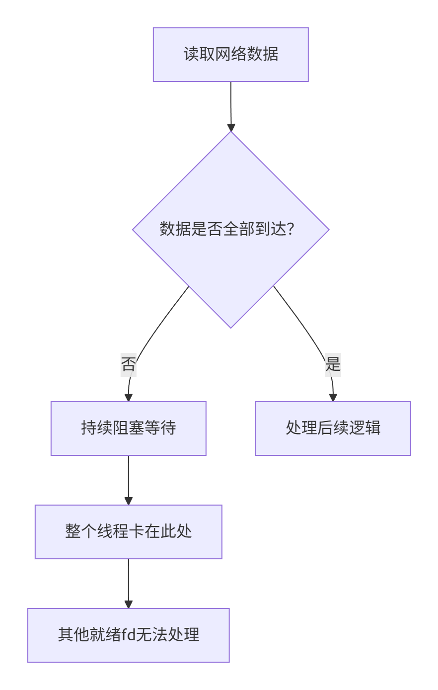

# 第一阶段

大概持续一个月时间，完成如下任务：

> - 专栏2视频：弄清楚多线程的 epoll IO 多路复用、协程实现的 epoll IO 多路复用和异步 IO 的性能差异；
>
> - 专栏9视频：跟着做项目；


# 整个课程大纲介绍

学技术点 --> 通过技术点找业务场景 --> 面试通过业务聊技术点


全面提升工程师开发的能力

2 --> 9.1 --> 3 --> 9.5 --> 4 --> 9.2 --> 5 --> 9.3

运维/部署

6

性能分析，测试源码

7

分布式，多台机器的问题

8

基本知识点（建议有一定代码量观看），通过后面的专栏渗透

1

# 2.1 高性能网络设计专栏-网络编程

## 2.1.1 TCP 服务器简单实现

通过多线程处理多个客户端的 TCP 连接，并且通信之。

## 2.1.2 事件驱动 Reactor 的原理与实现

linux 内核中的 0，1，2 三个 fd 默认被使用了；

在 linux 内核中，一切的 IO 操作，在内存中都被抽象成了 fd 作为内存数据传输的媒介。

### 2.1.2.1 select/poll/epoll


### 2.1.2.2 Reactor

IO 多路复用对比传统的 IO 有什么优势？
从本质来理解，网络 IO 消息处理分为两个阶段：等待消息到来 & 消息处理，在两个阶段同时处理的**单 IO 业务逻辑**中，等待消息到来会造成线程阻塞等待，并且频繁的切换线程状态，使得 CPU 资源利用率低下，无法实现高并发。所以，我们需要将等待消息和消息处理的两个业务逻辑分开，减少线程的状态切换，充分利用 CPU 资源，实现程序高并发。

IO 多路复用，多路复用指的就是等待消息的线程，可以同时等待多个连接（让内核监测消息的到来，并且监测的 fd 需要设置非阻塞），一旦消息到来，就通知消息处理的线程执行。Linux 内核提供了 IO 多路复用机制，而实现高并发，需要我们自己实现业务逻辑。

Reactor 和 Proactor 都是两种高效的事件处理模型，可以实现高并发。

> 高并发程序关键：**IO多路复用机制、fd非阻塞、高效的IO事件处理模型**。
>
> **IO 多路复用**：一请求一线程方式处理网络IO，等待消息到来和消息处理两个阶段是没有分开的，而 IO 多路复用对其进行了分开。
>
> **fd 非阻塞**：非常关键，如果 fd 是阻塞的，当调用读写系统调用时，对应 fd 数据没有准备好时，会阻塞，进而影响其它的 fd 处理，设置了非阻塞之后，当数据没有准备好时，`read()`会返回`EAGAIN`或`EWOULDBLOCK`错误，提示消息处理的业务逻辑稍后再试，参考下图。
>
> <center>
>   
> </center>
>
> 高效的 IO 事件处理模型：Reactor 或 Proactor，分别对应同步 IO 和异步 IO。
>
> 

# 2.2 高性能网络设计专栏-网络原理

## 2.2.1 Posix API与网络协议栈

linux网络编程用到的 POSIX API 基本就是下面的总结。

> 客户端：
>
> ```c++
> socket();
> bind();
> connect();
> send();
> recv();
> close();
> ```
>
> 服务器端：
>
> ```c++
> socket();		
> // 创建监听客户端 TCP 连接的 socket
> bind();			
> 
> // 绑定监听 socket 的 IP 和 port
> listen();		
> 
> // 监听客户端的第一次握手，发送第二次握手，并且为与客户端进行 TCP 通信创建 TCP control block，加入到 syn_queue（TCP 半连接队列）中，直到客户端发送第三次握手，通过 TCP 五元组进行匹配，将 syn_queue 中的 tcb 加入到 accept_queue（TCP 全连接队列）中。
> 
> accept();		
> // 从 accept_queue 中取出一个 tcb，并且为其分配 TCP 通信所需要的 fd
> 
> recv();
> send();
> close();
> 
> // IO 多路复用
> epoll_create();
> epoll_ctl();
> epoll_wait();
> fcntl();	// 设置 fd 属性，比如非阻塞等
> ```
>
> 

一些问题

1.在服务器中，一个 TCP 通信对应一个 TCP 控制块，TCP 控制块是否可以简单的理解为和 PCB 类似的东西，存放了 TCP 五元组和对应的 fd 等关键信息。

2.关于 syn 队列和 accept 队列，其维护的数据结构内容是每一个 TCP 连接对应的 TCP 控制块。

3.listen() 系统调用

> TCP 连接的被动接收方（服务器）调用，从 CLOSED 转换为 LISTEN 状态。
>
> - 返回的 fd 对应的内核空间，是否维护了 TCP 连接过程中的 syn 队列和 accept 队列？
> - 面试的时候，直接回答第二个参数表示 TCP 全连接 accept 队列的长度就行了吧？
> - 所以，TCP 三次握手的整个过程，都在 listen() 系统调用中是吗？

4.accept() 系统调用

> - 从 TCP 全连接队列中取出一个 TCP 控制块，并且为其分配与客户端通信的 fd，根据我现有知识的理解，感觉是错的（fd是否可以分为两部分，一个是 TCP 读缓冲区，一个是 TCP 写缓冲区，比如注册了 EPOLLOUT 和 EPOLLIN，对 fd 的读写是可以同时进行的，这是否也符合了 TCP 全双工通信的特点）。

5.recv() 和 send() 系统调用

> 网路层为了保证数据传输的够快，并且可靠传输，会用到大致以下机制：
>
> - 慢启动
> - 拥塞控制
> - 滑动窗口
> - 延迟确认
> - 超时重传
>
> .........
>
> 

6.close() 系统调用

> 主动关闭方调用 close()
>
> - TCP 控制块的 fd 回收
>   - 这里回收了 fd，TCP 控制块开辟的内核缓冲区应该没有被释放吧，既然 fd 回收了，那么如何接受被动关闭方第二次挥手携带的数据呢？
>
> -  发送 fin 报文段
>
> 不寻常的情况
>
> 1.主动关闭方先收到第三次挥手的 fin，没有收到第二次挥手的 ack
>
> 
>
> 2.通信双方同时调用 close()，都成了主动关闭方
>
> 这个时候，双方同时进入 fin_wait_1 状态，然后由于下一阶段都是接收 fin 报文段，所以双方跳过了 fin_wait_2 状态，直接进入到 time_wait 阶段

7.connect() 系统调用

> 一般地，主动连接方（客户端）调用 connect() 系统调用，发送 syn 报文段，进行第一次挥手，从 CLOSED 进入 SYN_SENT 状态，然后， 被动连接方从 LISTEN 进入到 SYN_RCV 状态，并且发送 syn 报文段，进行第二次挥手，主动连接方接收到 syn 报文段后，进入 ESTABLISHED 状态，并且发送 ack 进行第三次挥手，被动接收方收到第三次挥手的 ack 后，也进入到 ESTABLISED 状态。
>
> 不寻常的情况
>
> TCP 通信双方同时调用 connect() 系统调用，都成为主动连接方，比如 P2P 协议，这个时候双方既是主动连接方，也是被动连接方，会经历 6 次握手（也就是 3 次握手的 copy）。
>
> ```c++
> // 通信双方同时调用
> fd = socket();
> bind(8000);		// optional，P2P协议会有此系统调用，通过 bind，让对端连接
> connect();
> ```

课后作业：两台虚拟机实现 p2p 协议。

课后作业先放一下。

## 2.2.2 UDP 的可靠传输协议QUIC

TCP 协议层面做到可靠性传输

> - ACK 机制
>
> - 重传机制 & 重传策略
>
> - 序号机制
>
> - 重排机制
>
> - 窗口机制、流量控制、带宽有限

ARQ 自动重传请求

> TCP 如果丢包，会执行指数退避算法

流量控制

> 1.拥塞窗口
>
> 指数退避算法等，从整个网络的角度控制发送方发送数据的速率，防止网络拥塞。
>
> 2.接收窗口
>
> 接收方收到数据后，剩余的缓冲区大小，表示最多还能接收多少数据，从接收方控制发送方发送数据的速率。
>
> 发送方发送窗口大小 = min{拥塞窗口、接收窗口}
>
> 注意：接收窗口大小不是固定的，会根据丢包情况动态调整。

# 2.3 高性能网络设计专栏-自研协程框架

## 2.3.1 协程设计原理与汇编实现

1、为什么要有协程？

同步编程，异步性能 ==> 提升程序 IO 效率，上下文切换开销小。

2、从 B/S 互联网产品（B站、xhs等等）设计的角度出发，同时发出多个 HTTP 请求，协程有什么优势。


3、协程实现过程，原语操作（哪些原语操作）？

> 协程实现的三种机制：
>
> - `setjmp/longjmp`：代码复杂，跨平台性最好；
> - `ucontext`：代码较为简洁，跨平台性差（推荐）；
> - 汇编 ==> 借鉴线程或进程的思想：代码实现依赖于 CPU 的体系结构。
>
> 性能：汇编 > `setjmp/longjmp` > `ucontext`。


4、调度器如何定义？


5、调度器的执行策略？


6、利用 `posix api`实现协程？


7、协程的执行流程？


8、协程的多核模式？


9、协程的性能如何测试？


## 2.3.2 协程调度器实现与性能测试

关于协程如何写到简历当中：

> 1. 协程是一个网络框架；
> 2. 通过协程实现一个 webserver，KV存储（组件）；
> 3. 实现一个产品，图床等项目（通过自己的组件，比如 KV 存储，而不是使用 redis）。

整个 2.3 内容紧扣<font color = red>关于协程的本质 ==> 将同步的 `recv/send` 改为异步的 `recv/send`</font>。

# 2.4 基于 dpdk 的用户态协议栈实现

## 2.4.1 用户态协议栈设计实现

DPDK 环境搭建

> 如何运行 DPDK 程序
>
> 1. 先将 DPDK 的动态库加载到系统的环境变量中；
>
> 2. 解除内核监管的指定网卡`ifconfig eth0 down`，运行 DPDK setup 程序。

> 围绕四个点：
>
> - 网卡
> - 网卡驱动
> - 协议栈
>   - 以太网
>   - IP 协议解析
>   - UDP 解析
>   - TCP 解析
> - POSIX API
>
> a. dpdk 的环境搭建
>
> 1. 多队列网卡
> 2. `hugepage`（动态内存管理，大页）
>
> b. 用 dpdk 实现收到的数据
>

## 2.4.2 TCP的原理实现

**宏观上的计算机网络结构**

**协议层的数据组织相关**

> 传输层分为 UDP 包 和 TCP 包
>
> <center>
>    </center>
>
> 
>
> 网络层 IP 包组织形式
>
> 数据链路层以太网帧组织形式

**一些问题**

> 以太网帧中，源 MAC 和目的 MAC 改变之后，CRC 会改变吗？
>
> 
>
> UDP 协议中，标记的 UDP 包的长度，TCP 协议为什么不用标记 TCP 包的长度？


课后作业，实现一个基于 dpdk 的发包工具。

## 2.4.3 TCP/IP 定时器与滑动窗口

主要内容

tcp 三次握手的实现

tcp原理 ==> 传输、滑动窗口、慢启动、拥塞控制、超时重传

面试题拓展

三次握手最后一次 ack 包，持续发送的原因是什么？

## 2.4.4 应用层实现 EPOLL

用户态 TCP 协议如何实现并发？

> - 通过一请求一线程 ==> 验证协议栈是否支持并发
> - 通过 EPOLL 来验证协议栈是否支持并发

代码实现的是一个 EPOLL，多个 EPOLL 该如何实现？

EPOLL 为什么会选择红黑树，核心原因是什么？为什么不用 hash，b树，Skip Table？

> - 查找性能不低；
> - 内存线性增长；
> - 允许不连续的内存；
>
> hash：不能做到内存线性增长；
>
> B树：存储的是整个结构体内容，浪费较多内存；
>
> Skip Table：实现较为复杂。

# 2.5 异步 IO 机制 `io_uring`

```c++
// 请求和数据返回用户空间是一起的
read();
write();
recv();
send();

io_uring_setup();
io_uring_enter();
io_uring_register();

liburing();
```

> 工作队列出现的问题
>
> - 频繁 copy 过程
>
> - 如何做到线程安全

`reactor` 与 `proactor` 的区别？

自行总结三点区别。

整个第二章学习围绕如下：

> 关于网络编程
>
> - 一请求一线程 TCP 并发
> - `select/poll/epoll` 实现 TCP 高并发
> - 协程 `ntyco`
> - 基于 dpdk 实现的用户态 `tcp/ip` 协议栈
> - 异步 IO，`io_uring` 和 `iocp`

两个值得思考的面试题

> UDP 并发如何做？ ==> 最好总结成一篇技术文章
>
> TCP 与 UDP 的区别？
>
> - TCP 基于连接，UDP基于数据；
> - 分包与粘包的解决方案；
> - 
> - 并发的做法；
> - 使用场景；
> - UDP 基于短连接，TCP基于长连接。


# 9.1 基础设施/架构/中间件的项目：KV存储

> 既然有了 `redis`，`memcached`，`mongodb`，为什么还要自己做一个 KV 存储的项目呢？
>
> - 每个公司有其自己的业务流程，开源的中间件不一定适用，亦或者说是臃肿；
> - 把性能做到更优；

问题：

> `kvstore` 为什么设计成单线程，而不是多线程？
>
> 如何在 `kvstore` 中实现范围查询，使用什么数据结构？
>
> KV 存储的内存管理实现 ==> 基于内存池？


# EPOLL 原理复习

> 正常的，对 fd 注册 EPOLLIN，EPOLL 工作机制是内核检测到内核空间 fd 缓冲区有数据可读，然后将其从红黑树零拷贝到就绪链表中，应用程序通过 epoll_wait() 将就绪链表中的 epoll_event 结构体拷贝到用户空间中，然后就可以通过用户空间的 epoll_event 结构体获取发生 EPOLLIN 事件的 fd，对其进行读操作即可。
>
> **我们常说的 TCP 内核缓冲区和 EPOLL 监测 fd 的内核缓冲区是一个东西吗？** 
>
> 应该是一个东西哈，因为 accept() 返回的就是 TCP 通信的 fd，我们是将这个 fd 注册的 EPOLLIN 事件的。
>
> **如果一个客户端向 web 服务器发送 100 GB 数据，EPOLL注册的 TCP 通信内核缓冲区只有 1GB，怎么接收呢？**
>
> 参考 TCP 的流量控制，接收方通过接收窗口的大小，频繁的接收数据即可，总之数据不会被丢失。
>
> **EPOLLET 与 EPOLLLT 的区别，以内核缓冲区有 1G 数据为例，程序通过 `recv()` 系统调用每次只从内核读取 1KB 的数据？**
>
> ```c++
> // 先决条件，开辟了一个 1024 字节的用户缓冲区
> // fd 注册了 EPOLLIN 事件，内核缓冲区有 1GB 数据可读
> char buf[1024];
> int n = read(fd,sizeof(buf),0);
> ```
>
> - **EPOLLLT：**内核会在一段时间内一直标记 fd 为 EPOLLIN 事件发生了，这会导致 epoll_wait() 一直被调用，使得 OS 频繁进行 "变态"，导致不必要的系统开销，这里 epoll_wait() 一共被调用了 1GB/1KB 次；
> - **EPOLLET：**只有 TCP 内核缓冲区从空变为了非空，才触发一次 EPOLLIN 事件，`epoll_wait()` 解除阻塞，用户空间必须循环读取内核空间的数据，直到返回 EAGAIN 为止，减少了 `epoll_wait()` 的调用次数，这里 `epoll_wait()` 只调用了一次，就完成了内核空间数据的读取。
>
> **什么时候用 EPOLLLT：**当内核中，数据不多或者 `recv()` 一次接收很多数据，不会触发太多次 `epoll_wait()`，就可以使用水平触发模式，因为 EPOLLET 的代码相对复杂一些；
>
> **什么时候用EPOLLET：**和上述情况相反。

