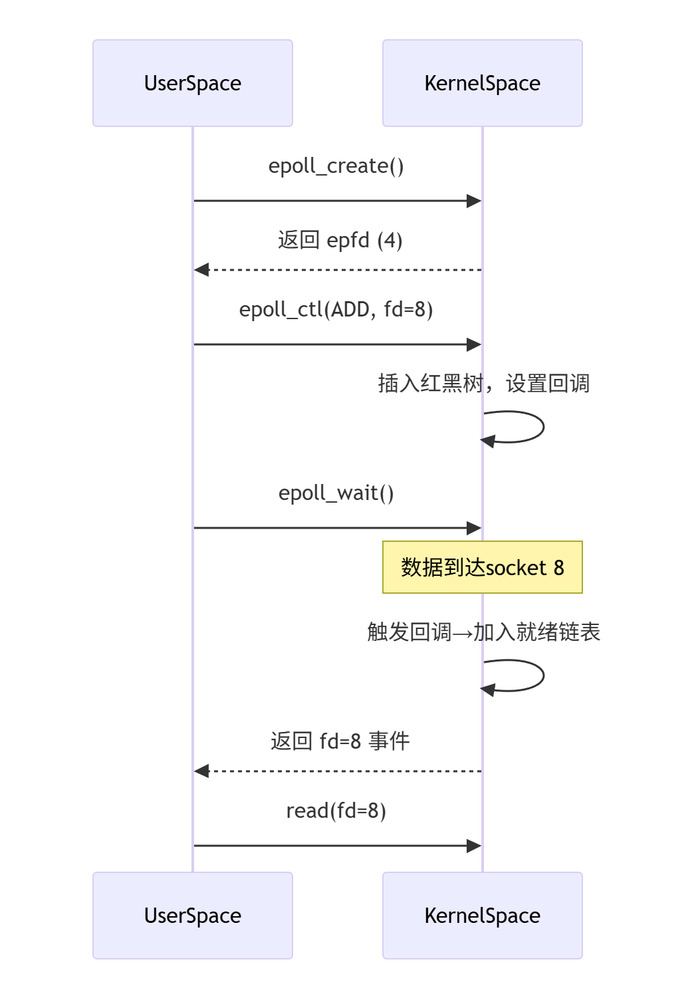
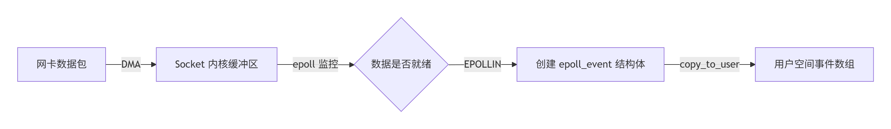

# 即构科技一面和二面复盘

## 自我介绍

没什么好说的，照着稿子念，不知道有没有机会背下来🤣🤣🤣......

## 值得复盘的问题

### 一面

**问题0**：项目二，解释一下这个气象数据是怎么来的，项目有什么作用吗？


**问题1：**解释一下 MVVM 模式？


**问题2：**谈一谈什么是虚函数，什么场景下会把一个函数设置为虚函数，说一下什么是虚函数表？

> - 在类中，virtual 关键字修饰的函数就是虚函数；
> - 当子类需要重写父类的函数时，需要将该函数设置为虚函数；
> - 存放了类中，每一个虚函数所在内存当中的入口地址，就是虚函数表，在调用虚函数时，通过虚函数指针在虚函数表中找到虚函数调用的入口地址。


**问题3：**构造函数可以是虚函数吗，构造函数中可以调用虚函数吗？

不可以。


**问题4：**说一下你在做项目的过程中遇到的最大问题是什么，以什么样的方式解决的，有什么收获？

> 项目一：
>
> - QPS 上不去，分析程序耗时的性能（复杂的业务逻辑 or 耗时的 IO 操作）；
>
> 项目二：
>
> - 在 c++ 中使用 oracle，需要第三方库，使用了 github 开源的 oracle 数据库操作框架；
>
> 项目三：
>
> - 点击按钮，视频卡顿问题，目标检测算法不能同时执行。


**问题5：**说一下 `unique_ptr` 和 `shared_ptr` 的区别，如果让你实现 `shared_ptr` ，你会怎么做，什么时候让引用计数加1，什么时候让引用计数减1（场景题目，很值得思考）？

仔细回想一下，这一题存在一个细节，`shared_prt<T>` 对于引用计数，是原子操作，需要保证线程安全，对引用计数进行操作时，需要使用线程同步相关的方法。


**问题6：**说一下 C++ 中的菱形继承会出现什么问题，有什么解决方案？

面试的时候，好像回答错了，而且解决方案也没回答正确。

**优化：**会出现爷爷类中，数据的二义性问题，孙子类会存在两个爷爷类的副本，解决方案如下：

> - 父类通过虚继承爷爷类解决，这时候子类只存在一个爷爷类的副本；
>
> - 通过作用域解析符来解决二义性问题。


**问题7：**了解死锁吗，如果发生死锁了，如何解除死锁？

> 死锁的四个必要条件：
>
> - 互斥：
> - 非剥夺：
> - 占有等待：
> - 循环等待：

**问题8：**关于一些 C++ 经典的语法题目？

```c++
int a = 3;
int b = 4;
int c;
c = a++, b++, c=a+b;
printf("%d\n",c);
// 这里回答 c=3 答错了，实际 c=9，面试居然还说对逗号运算符有印象，丢人🤣
// 逗号运算符优先级是最低的，所以表达式被拆分为 c=a, a++, b++, c = a+b
// 对于有多个逗号的语句，不用紧张，非常简单，从左到右计算就好啦！

char str[] = "abc";
char* p = "abc";
cout<<sizeof(str)<<strlen(str)<<sizeof(p)<<strlen(p)<<end;
// 这里主要考察 sizeof(), strlen(), 指针的基本概念，答得没问题，直接秒了
// 需要注意的是，所有指针，在 32 位的 OS 中是 4 字节，在 64 位的 OS 中是 8 字节
```

#### 总结

整体答得非常一般，逻辑表达能力还值得继续锻炼，甚至还有答错的，而且手撕题目也没有做出来，非常的减分，没事把 hot100 和写过的算法题多刷一下把（主要是思路真的想不起来了，很难受）。

**收获：**复习了内存映射，对于问题 4 终于能答上来一点啦（还是有进步的😄），这里主要说了内存映射和传统 IO 在磁盘大文件上读取的性能差异。

### 二面

**问题1：**上来直接问 webserver 的项目，说一下这个项目是如何做到 5k+ QPS 峰值的（其实也差不多就是问项目有哪些重要的实现细节吧）？

核心技术：EPOLL IO 多路复用 & 线程池 & 有限状态机解析 HTTP 请求 & 静态资源的内存映射和分散写


**问题2：**接着问题 1 的深入，既然 1s 内能做到处理 5k+ 的 HTTP 请求处理，那么，如果同时有 10w+ 的 HTTP 请求同时需要被处理，应该怎么办呢？

这里我是结合 `listen()` 和 `accept()` 系统调用，以及半连接队列和全连接队列来回答的，但是回答的有点不自信，因为对于整个过程还是没有非常的清楚，需要结合系统调用和 TCP 三次握手具体复习一下。


**问题3：**考虑过安全问题吗，比如有恶意攻击服务器的客户端，一直向你的服务器发送 HTTP 请求，该如何处理？

没有考虑过啊~~~


**问题4：**简单聊一下 EPOLL 的原理？

从单线程，多线程进行 TCP 通信的缺陷入手，然后再从 IO 多路复用的本质去回答，让 OS 内核监听 TCP 缓冲区是否有数据的到来，通过设置 TCP 缓冲区对应的 fd 非阻塞，完成 IO 消息等待和消息处理两个部分的分离，实现高并发处理 TCP 连接。

先从宏观的角度去了解一下 EPOLL 在内核中的工作机制吧，DS 的图不错。

<center>
  
</center>

内核中，EPOLL 的具体实现数据结构是基于**红黑树和就绪链表**的，红黑树存放了注册监听事件的 fd，就绪链表中存放了已发生事件的 fd，基本工作流程如上图所示。

```c++
// 1. 创建 epoll 文件句柄
epoll_create();

// 2. 为 fd 注册监听的事件（委托内核），将 fd 加入到红黑树中，并且设置回调函数
epoll_ctl();

// 3. 阻塞等待就绪链表中是否有已发生事件的 fd
// 3.1 内核检测 fd 有事件发生，触发 fd 的回调函数，将 fd 加入到就绪链表（元素是指针，属于零拷贝技术，但是指针还是会占用内存）中
// 3.2 就绪链表的数据会从内核空间拷贝到用户空间（epoll_event 结构体）
epoll_wait();

// 4. 处理对应的 fd 发生的事件
read();

```

> 关于 EPOLL的水平触发（默认）与边缘触发（EPOLLET）的一些细节，以 EPOLL 就绪链表从内核空间拷贝到用户空间（`epoll_event`）为例。
>
> <center>
>   
> </center>
>
> 水平触发，不断通知，会触发多次 `epoll_wait()` 系统调用，代码简洁，效率一般；
>
> 边缘触发，只通知一次，只会触发一次`epoll_wait()`系统调用，代码复杂，效率较高。
>


**问题5：**刚刚聊到了项目一中，对 HTTP 请求的资源文件有读入内存的过程，那么有实现写文件的功能吗（这里面试官还科普了分布式相关的内容，说多个服务器向一个磁盘写文件的过程，如何实现安全的写入）？


**问题6：**说一下什么是 MVVM 软件架构模式吧？

秒了，结合项目三来回答，更直观和清晰。


#### 偏向于智力的题

**问题1：**两只青蛙，跳跃的速度不同（m/s），在一个环形的操场上，从不同位置起跳，怎么以尽量高效的方法，求得在哪一个时刻相遇？

**问题2：**如何在不同高的楼层（1w层或者10w层），测出鸡蛋能够不碎掉的最大楼层（想出的算法尽量和楼层关系不大，尽量高效，也就是消耗的鸡蛋数量尽可能少）？

#### 总结

二面的考察偏向于思维发散，基本考察的点都是对项目1如何优化。

## 手撕题目（一面）

哈希表的应用，原题没手撕出来（真的问题很大，之后二刷和复习主要记思路就行，思路有了很容易撕出来）。

[LC 128](https://leetcode.cn/problems/longest-consecutive-sequence/description/?envType=study-plan-v2&envId=top-100-liked)：最长连续序列