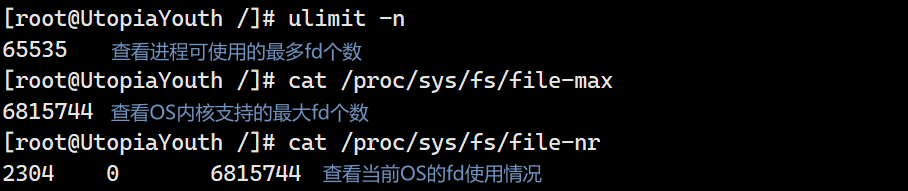

# 自我介绍

第一次线下面试，发挥的还不错，只要对项目用到的技术栈比较熟悉，自我介绍环节还是非常的流畅和自信的，而且还穿插了项目的背景。

# 问题回忆

**问题1：**说到了线程池，你的线程只开了5个，如何保证有多个 HTTP 请求任务到来时，都能够被处理掉呢，这里涉及到了服务器的性能问题，可以保证每一个 TCP 连接都被处理吗，亦或者是保证每一个HTTP请求都被处理吗？

> 这里可以分两种情况来讨论，一个方面是有多个 TCP 连接对应多个HTTP请求，另一个方面是一个 TCP 连接对应多个 HTTP 请求的情况。
>
> **多个 TCP 连接对应多个 HTTP 请求的情况**
>
> ```c++
> // 支持最大的文件描述符个数（最大的连接客户端数）
> #define MAX_FD 65535
> ```
>
> 正常的，一个 TCP 连接对应一个客户端，服务器会为该客户端的 socket 分配一个 fd，所以理论上来说，linux 内核支持最大 fd 的个数为 n，就能与 n 个客户端建立 TCP 连接，只有 TCP 连接建立了，才能够接受 HTTP 请求。
>
> 与客户端建立连接后，主线程为每一个客户端的 TCP 连接创建一个 `HttpConnection` 对象，客户端每发送一次 TCP 通信，服务器的 TCP/IP 协议栈就会对原始数据进行解封装，然后存储到 fd 对应的内核缓冲区中，之后触发 EPOLLIN 事件，主线程通过 `epoll_wait()` 系统调用，检测到 EPOLLIN 事件发生，就会调用与客户端通信 fd 对应的 `HttpConnection` 对象的`read()` 方法，将 TCP 通信的数据从内核缓冲区读取到 `HttpConnection` 对象的用户缓冲区中。 
>
> TCP通信的数据拿到用户缓冲区之后，会被主线程调用线程池的 `pool->append()` 方法，将 `HttpConnection` 对象加入到线程池的工作队列`list<T>`中。
>
> 线程池中的工作线程从工作队列中取出 `HttpConnection` 对象，执行其 `request->process()` 方法。
>
> `process()` 方法中，首先执行 `processRead()` 方法解析 HTTP 请求：
>
> - 客户端发送的 HTTP 请求数据完整到达，解析成功，继续调用 `processWrite()` 方法，生成响应状态行、响应头和资源，并且对 TCP 通信的 fd 注册 EPOLLOUT 事件；
> - 客户端发送的 HTTP 请求数据没有完整到达，当前工作线程没有解析成功，对 TCP 通信的 fd 重新注册 EPOLLIN 事件，交给主线程继续读取客户端发过来的 HTTP 请求数据（注意：下一次解析 HTTP 请求数据可能是其它工作线程了，因为主线程重新读取 HTTP 请求数据之后，会将 `HttpConnection` 对象重新加入到线程池的工作队列中）。
>
> HTTP 响应主线程调用 `write()` 方法，将`HttpConnection`对象缓冲区中的HTTP响应数据写入到内核缓冲区中，交由内核 TCP/IP 协议栈将 HTTP 响应结果发送给客户端。
>
> - TCP长连接：为与客户端TCP通信的 fd 继续注册 EPOLLIN 事件，并且清空对应`HttpConnection`缓冲区的数据，为下一次 HTTP 请求做准备。
> - TCP短连接：断开 TCP 连接。
>
> **一个 TCP 连接对应多个 HTTP 请求的情况**
>
> 在与客户端建立 TCP 长连接的情况，一个客户端向服务器发送多次 HTTP 请求，这里唯一的性能瓶颈应该有两部分：
>
> - 内核TCP/IP协议栈接收网络数据的快慢，受到TCP流量控制与拥塞控制的影响；
> - HTTP请求数据 copy 到用户缓冲区后，线程池中的线程需要解析 HTTP 请求和写 HTTP 响应，只有主线程调用 `write()` 方法，将 HTTP 响应的数据写入与客户端通信 fd 对应的内核缓冲区后，才会为该 fd 重新注册 EPOLLIN 事件，来检测下一个 HTTP 请求数据的到来。
>
> <font color = red>一个与客户端的 TCP 连接对应一个 `HttpConnection` 对象</font>。
>
> 综上，得出结论就是，TCP连接数量受到内核支持最大 fd 个数限制，程序可以在最大 fd 个数限制下，设置能够支持最多与客户端的 TCP 连接数量，超过了这个数量，TCP 连接就会失败。对于能够处理的最多 HTTP 请求数量，取决于线程池的工作队列大小，超过了线程池工作队列大小的 HTTP 请求任务，无法处理。

**拓展：**

> <center>
>   
> </center>
>
> ```shell
> ulimit -n 	# 查看当前进程支持的fd个数
> cat /proc/sys/fs/file-max		# 查看 OS 内核支持的最大fd个数
> cat /proc/sys/fs/file-nr		# 已分配|未使用|系统最大fd限制
> ```
>
> 可以通过上述命令查看 OS 内核的 fd 情况。


**问题2：**在项目一中，你觉得遇到的难点都有哪些？

> 当时答了三个点
>
> - HTTP 解析，HTTP1.1 默认保持 TCP 长连接，`Connection: keep-alive`字段；
> - 线程池的实现：主要是线程同步；
> - HTTP 响应大文件的 IO：使用内存映射的方法，减少内存拷贝开销。


**问题3：**针对线程池中的线程数量，如何确定的，有没有一个确定的模型？

> 这个问题被问过很多次了，每次都是简单的回答说 CPU 核心数的 1.5 倍，这里可以尝试想出一个解决方案，动态调整线程池数量。
>
> 


# 复盘拓展

## 项目一的线程同步

面试过程中，在回答线程同步的问题时，当时好像是说线程同步是基于互斥锁和条件变量实现的 ==> 不太对。

> 项目中线程池的线程同步是基于互斥锁和信号量实现的，线程同步的代码应该要非常熟悉，信号量的值就是工作队列`list<T>`的长度。
>
> ```c
> // 主线程调用线程池的 append() 方法
> pool->append();
> 
> // append() 下的伪代码，向
> bool append(T* request){
>   mutex.lock();
>   queue.push_back(request);
>   mutex.unlock();
>   sem.post();
> }
> 
> // 线程池的工作线程 worker() 和 run() 下的伪代码
> static void* worker(void* arg){
>   ThreadPool* pool = (ThreadPool *)arg;
>   pool->run();
>   return pool
> }
> 
> // 这里封装一个成员函数 run() 方法，方便访问成员变量和成员方法
> void run(){
>   while(!stop){
>     sem.wait();
>     mutex.lock();
>     if(queue.empty()){
>       mutex.unlock();
>       continue;
>     }
>     T* request = queue.pop_front();
>     mutex.unlokc();
>     
>     if(!request){
>       continue;
>     }
>     request.process();
>   }
> }
> ```
>
> 

## 代码优化

> 增加超过线程池工作队列大小的 `HttpConnection` 对象处理：
>
> ```cpp
> if (!pool->append(users + sockfd)) {
>   // 线程池工作队列已满，HTTP 请求数据丢失
>   users[sockfd].clearBuffer();
>   continue;
> }
> ```
>
> 